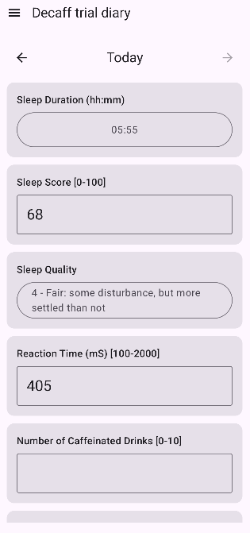
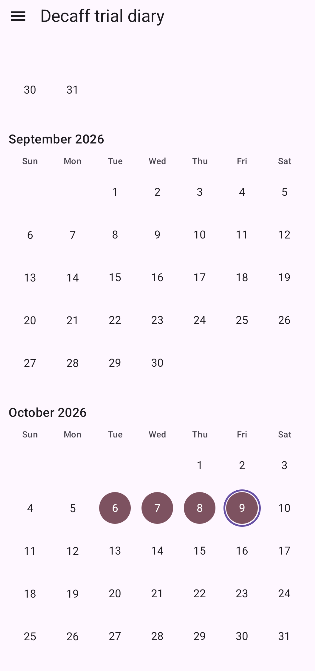

# TrialTracker

A generic Android form-engine app for recording repeated daily observations during a short-term personal trial (e.g. ~10 entries/day for a few weeks or few months).

It is intended to roughly align with FHIR practices.

<table>
  <tr>
    <td align="center">
      
    </td>
    <td align="center">
      
    </td>
  </tr>
  <tr>
    <td align="center">Entry</td>
    <td align="center">Summary</td>
  </tr>
</table>

## Goals

- Minimal friction during daily data entry (no explicit save button, large touch targets, fast to fill in).
- Configurable from FHIR-shaped `ServiceRequest` and `Questionnaire` JSON files.
- Export all recorded results as FHIR-shaped `QuestionnaireResponse` JSON (and optionally CSV).
- Review and edit previous days' entries.
- App has minimal permissions.

## Compatibility

- `minSdk` = API 30 (Android 11).

## Using the app

On first startup, the app opens on the 'Trial and Questionnaire' screen. It requires you to load two JSON files:
- `ServiceRequest` describing the trial as a whole, and
- `Questionnaire` listing the specific questions to be asked.
See the `samples/` directory for example files.

For subsequent startups, the app opens on the 'Entry' screen. A hamburger menu (modal navigation drawer) gives access to:
- **Entry** — the main daily-entry screen. A vertical list of fields; all typing is auto-saved on every (valid)
  keystroke, so there is no explicit save button.
- **Summary** — a calendar view of the trial so far.
- **Trial and Questionnaire** — load/review the active ServiceRequest and Questionnaire.
- **Export results** — write results out as `.json` or `.csv`.
- **Settings**
- **Help**

## Privacy / data handling

The app declares no Android permissions. It has no network access and cannot reach shared storage, camera, or contacts. It only uses its own private storage.

Android's auto-backup is deliberately disabled (`android:allowBackup="false"` in the manifest). Consequently:
- potentially sensitive data does not leave the device and end up in the cloud
- loss or damage to the device means loss of all trial data (this may be ameliorated by manual periodic export and saving externally).

## Architecture / Contributing

See [ARCHITECTURE.md](ARCHITECTURE.md) for architecture notes, build environment quirks, and testing/linting conventions.

See [CONTRIBUTING.md](CONTRIBUTING.md) for contribution status.

## Licence

MIT — see [LICENCE](LICENCE).
